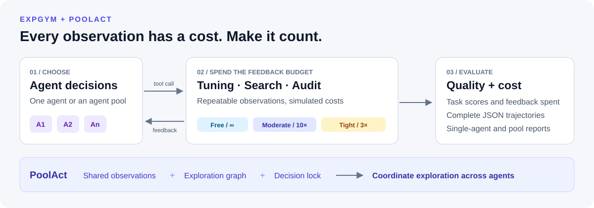

# ExpGym

**Evaluate how agents spend scarce feedback. Scale their exploration with PoolAct.**

[](https://github.com/tiannuo-yang/expgym/actions/workflows/tests.yml)
[](pyproject.toml)
[](LICENSE)

[Quick start](#quick-start) · [Benchmarks](#benchmarks) · [PoolAct](#poolact) · [Use your model](#use-your-model) · [Documentation](#documentation)

An agent can reason for another turn, but can it afford another experiment, document retrieval, or human review? **ExpGym** evaluates tool-using agents when each observation consumes a feedback budget. **PoolAct** lets multiple agents coordinate their exploration through shared observations, an exploration graph, and a decision lock.

Research code for *When Interaction Is the Bottleneck: Evaluating and Scaling Agents Under Costly Feedback*.



## Why ExpGym?

- **Make feedback cost part of the task.** Compare the same agent under free, moderate, and tight budgets, or set your own budget multiplier.
- **Run repeatable environments.** Pre-cached observations, tabular benchmarks, and deterministic surrogates make costly interactions practical to evaluate locally.
- **Compare ways to scale agents.** Run independent agents, agents sharing a cache, and PoolAct with the same task interface and per-agent budget.
- **Inspect the full trajectory.** Save tool arguments, visible and withheld observations, feedback cost, model usage, final answers, and scores as JSON.
- **Bring your own model or task.** Use an OpenAI-compatible chat endpoint with native tool calling, or register a custom environment in Python.

The core package depends only on NumPy. Search data loading additionally uses PyArrow. Feedback costs are **simulated time**, separate from wall-clock latency and provider charges.

## Quick start

Clone and install from source. The core supports Python 3.7+; the legacy ParamNet tasks require a [separate Python 3.7 environment](docs/installation.md#paramnet-environment).

```bash
git clone https://github.com/tiannuo-yang/expgym.git
cd expgym
python3 -m venv .venv
source .venv/bin/activate
python -m pip install --upgrade pip
python -m pip install -e .
```

Run a complete single-agent evaluation with a scripted model. **No API key or benchmark downloads required.**

```bash
python -m expgym run --task toy --backend scripted --output runs/quickstart
python -m expgym summarize runs/quickstart
```

This runs the toy tuning task under all three feedback regimes and writes one JSON trajectory per regime. The summary reports a Gap Score for each budget. Now compare all three multi-agent strategies:

```bash
python -m expgym pool --task toy --backend scripted \
    --regimes tight --strategies naive,cached,poolact \
    --agents 4 --output runs/quickstart
python -m expgym summarize runs/quickstart
```

The report now includes single-agent and pool results. These scripted runs verify the execution path; use a real model to evaluate agent quality. After installation, `expgym` is also available as a command.

## Benchmarks

| Task | What the agent does | Evaluation set | Metrics |
|---|---|---|---|
| **Tuning** | Choose a configuration, then request its validation performance | 9 tasks across ParamNet, NAS-Bench-101, and NAS-Bench-201 | Gap Score against a 100K-sample random-search reference |
| **Search** | Retrieve articles to answer a three-hop question | 73 PhantomWiki questions: 39 *whois*, 34 *whatis* | Set F1 over answer names |
| **Audit** | Request feedback on evidence for a contract hypothesis | 13 ContractNLI documents × 17 hypotheses | Label accuracy and exact evidence-set accuracy |
| **Toy** | Explore a synthetic tuning problem | One built-in task; no external data | Gap Score |

Tuning charges the configuration's simulated training time. Search charges 280–320 simulated seconds for each new article; retrieving an already seen article is free. Audit charges 280–320 simulated seconds for every feedback request.

### One task, different feedback budgets

Each agent receives a budget **B = β × c_base**, where `c_base` is the task's reference feedback cost.

| Regime | β | What the agent sees |
|---|---:|---|
| `free` | ∞ | Observations without cost information |
| `moderate` | 10 | Observations, their costs, and remaining time |
| `tight` | 3 | Observations, their costs, and remaining time |
| `beta=<x>` | Custom | The same cost-aware interface with your chosen budget |

The call that reaches or exceeds the budget is charged, but its result is withheld. At the budget boundary or the step limit (30 by default), the agent must answer from the evidence it has already seen. See the [benchmark protocol](docs/benchmark.md) for scoring and budget details.

## PoolAct

PoolAct coordinates several agents working on the same item. Each agent keeps its own simulated clock, full feedback budget, and step limit.

| Strategy | Shared completed observations | Shared exploration graph | Decision lock |
|---|:---:|:---:|:---:|
| `naive` | — | — | — |
| `cached` | ✓ | — | — |
| `poolact` | ✓ | ✓ | ✓ |
| `poolact --no-lock` | ✓ | ✓ | — |

**Share evidence.** A completed observation can be reused at zero feedback cost once it is visible at the requesting agent's simulated time. In-flight requests are not cache hits.

**Coordinate the next action.** Before deciding, each PoolAct agent sees the exploration graph, including completed and pending requests. The lock covers reading the graph, the model call, and registering the chosen request; tools execute after the lock is released.

Tuning pools report the mean agent Gap Score and best-of-N. Search pools vote over normalized answer sets. Audit pools vote per hypothesis on labels and evidence sets. See [PoolAct semantics](docs/benchmark.md#poolact-and-the-baselines) and [experiment settings](docs/experiments.md).

## Use your model

Install the data tools and download the search and audit datasets:

```bash
python -m pip install -e ".[data]"
python scripts/download_data.py --only search,audit
python scripts/download_data.py --only search,audit --check
```

Configure a chat endpoint that supports native function calling. The backend reads the model, base URL, and API key from these variables:

```bash
export EXPGYM_MODEL="your-model"
export EXPGYM_BASE_URL="https://your-endpoint/v1"
export EXPGYM_API_KEY="your-api-key"

# Single agent: five questions under the tight budget.
python -m expgym run --task search --items 0:5 --regimes tight \
    --output runs/search-demo

# PoolAct: four agents on one document, with one hypothesis ordering.
python -m expgym pool --task audit --items 0 --regimes tight \
    --strategies poolact --agents 4 --repeats 1 --output runs/audit-demo

python -m expgym summarize runs/search-demo
python -m expgym summarize runs/audit-demo
```

You can also pass `--model`, `--base-url`, and `--api-key-env` explicitly. Model sampling and reasoning options go through `--temperature`, `--top-p`, `--max-tokens`, and `--extra-body`. See [CLI options](docs/experiments.md#running-experiments).

Existing result files are skipped when a command is rerun. **Use a new output directory when changing settings for the same model**: the runner does not validate saved results against the new configuration.

## Add your own environment

Define the task prompt, tool schemas, per-call cost, and final-answer scorer; register the task to use it with both runners. The [compound-screening example](examples/custom_environment.py) includes a complete environment plus single-agent and PoolAct runs:

```bash
python examples/custom_environment.py
```

It runs offline by default. The [extension guide](docs/extending.md) covers registration, the Python API, custom model backends, and PoolAct graph hooks.

## Documentation

| Guide | What you will find |
|---|---|
| [Installation and data](docs/installation.md) | Optional dependencies, downloads, local data reuse, and ParamNet setup |
| [Benchmark protocol](docs/benchmark.md) | Task definitions, scores, budget boundaries, simulated clocks, and pooling |
| [Experiments and reproduction](docs/experiments.md) | CLI flags, item selection, repeat counts, paper settings, and ablations |
| [Custom environments and API](docs/extending.md) | Task registration, backends, and Python examples |
| [Outputs and source map](docs/reference.md) | JSON fields, aggregation outputs, and repository layout |
| [Third-party notices](THIRD_PARTY_NOTICES.md) | Dataset sources, pinned revisions, and licenses |

## Development

```bash
python -m pip install -e ".[dev]"
python -m pytest -q
```

The core tests use synthetic fixtures and scripted backends. The NAS-Bench reference test is skipped when its data is absent. CI runs the core suite and offline CLI examples without API credentials.

Bug reports and contributions are welcome through [issues](https://github.com/tiannuo-yang/expgym/issues) and pull requests. Include the command, Python version, and relevant error output when reporting a problem.

## Citation

If you use ExpGym or PoolAct in your research, please cite *When Interaction Is the Bottleneck: Evaluating and Scaling Agents Under Costly Feedback*. The source release currently provides anonymous author metadata; the entry below preserves it pending a public bibliographic record.

```bibtex
@inproceedings{expgym2026,
  title  = {When Interaction Is the Bottleneck: Evaluating and Scaling Agents Under Costly Feedback},
  author = {Anonymous Authors},
  year   = {2026}
}
```

## License

Code is released under the [MIT License](LICENSE). Benchmark data retain their original licenses; see [third-party notices](THIRD_PARTY_NOTICES.md).
